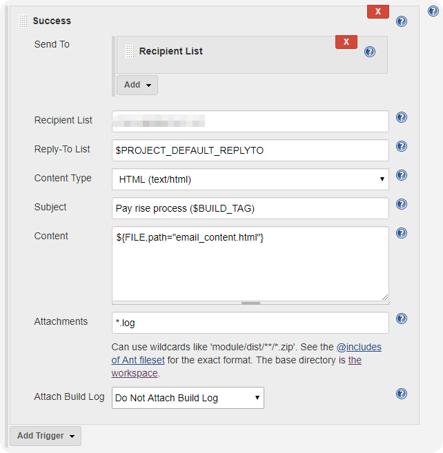
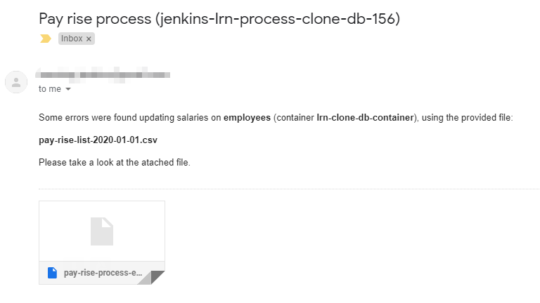

# docker-mysql-clone-jenkins

If you are working with databases on a daily basis, you are very much used to facing the task of checking beforehand all scripts or processes which update massively your tables: preparing a backup into a spare server, running the process on that copy (probably a script someone else gave you) and taking a look at all messages the database server spit out.

Very likely you already have found some ways to make easier these tasks, you know, the path of least resistance. However, let me show you a nice solution combining the automation server **Jenkins** and the container images tool **Docker**.

As well as sharing this solution to a daily issue with all those who work on data field, I would like to give a first approach to everyone wants to learn about **Jenkins** and **Docker** building a real project and explaining step by step from scratch, how to get it.

The diagram below shows you the bigger picture:


Two Jenkins projects make all the work. The **clone job** dumps a production database copy into a **backup file**, creates a new **Docker container** using a **MySQL image** and loads the backup. The **update job** is launched once the first finishes, runs the database script on the Docker container, checks the database logs and sends a customised email with the results. Both jobs run sequentially and temporary elements are removed, cleaning up each previous execution.

The good thing about using those automation tools is that you can easily perform multiple tasks in sequence, schedule them and use many advanced functions thanks to free plugins like **Email Extension**.

## Requirements

The infrastructure to setup is very simple. Do not waste your time, a **virtual machine** with **Ubuntu Server** would be more than enough.

When it comes to required sofware, all of them are free open and easily accesible on the Internet. In fact, you only need to install **Jenkins Server**, **Docker** and **MySQL Docker Image**.

In order to make a **fully functional project** starting from scratch, a **sample database** will be provided so that you will have \"real data\" to mess around. That is why you need to install a **MySQL Server instance** as well. Although you can find the creation and load scripts in `employees-database` folder, feel free to download the original database from [Giuseppe Maxia's Github repository](https://github.com/datacharmer/test_db). You will also be provided with a **Database script** to run on the database clone.

Since your project is sending emails with the last results, You need two valid **email accounts**, one to send the result and the other to receive it.

## Installation

Our starting point is a clean **Ubuntu Server 18.04** virtual machine using **Oracle VM VirtualBox**. 

It is recommended to follow the steps below. This is the shortest and most proper way.

### MySQL

Install MySQL.
```
$ sudo apt-get update && sudo apt-get install mysql-server
```
Run this utility to set a password for `root` account and remove test database.
```
$ sudo mysql_secure_installation
```
Test installation is OK.
```
$ sudo /bin/systemctl status mysql
``` 
Check you can access using the mysql client.
```
$ sudo mysql -u root -pXXXXX
```
Check the MySQL Server version
```
mysql> SHOW VARIABLES LIKE '%version%';
```
It comes in handy to create a specific user to perform backup operations. You can do it running these SQL statements using `root` user.
```
mysql> CREATE USER 'backup-user'@'%' IDENTIFIED BY 'backup';
mysql> GRANT SELECT, RELOAD, LOCK TABLES, REPLICATION CLIENT, SHOW VIEW, EVENT, TRIGGER ON *.* TO 'backup-user'@'%';
mysql> FLUSH PRIVILEGES;
```
Exit MySQL client
```
mysql> quit
```

Load sample database (**employees**), moving the entire content of the repository folder [employees-database](employees-database) into a local folder on your virtual machine and running from that folder
```
$ sudo mysql -u root -pXXXXX < employees.sql
```

### Jenkins

Jenkins requires Java 8, it does not support newest versions. Check your present Java version because perhaps yours is more recent.
```
$ java -version
``` 
In case of several JVM on your system, which will usually be the case, use this command to change it and select the version 8 (1.8.0).
```
$ sudo update-alternatives --config java
```
Import the GPG keys of the Jenkins repository.
```
$ wget -q -O - https://pkg.jenkins.io/debian/jenkins.io.key | sudo apt-key add -
```
Add the Jenkins repository to the system.
```
$ sudo sh -c 'echo deb http://pkg.jenkins.io/debian-stable binary/ > /etc/apt/sources.list.d/jenkins.list'
```
Install Jenkins updating the `apt` package before.
```
$ sudo apt update && sudo apt install jenkins
```
Test service is up.
```
$ sudo service jenkins status
```
The installation process created an initial password you can print.
```
$ sudo cat /var/lib/jenkins/secrets/initialAdminPassword
```
Copy this password, you will need it later.

From now on, you will keep working with a **web browser** from your host machine. Do not forget that you are installing all applications on a Virtual Machine without graphical interface.

The web access to your Jenkins server is through the default URL http://127.0.0.1:8080, that is why you need to create a new **Port Forwarding Rule** before going on to allow this connection from your host to your virtual machine guest.

Now, you can open this url http://127.0.0.1:8080 from a web browser on your host to continue the installation, then paste the password you copied previously into the Administrator password field and click on `Continue`.

The next screen will ask you whether you want to install suggested or specific plugins. Click on `Install suggested plugins`, this part will take a long time, be patient. Once plugins are installed, you will be required to fill out your Admin User information and unlocking process is finished.

At this point, it only remains to assign a valid **email account** to be used by the **Email Extension Plugin**. Click on `Manage Jenkins` link and then `Configure System`, go to section `Extended E-mail Notification` click on `Advanced` and complete all necessary fields like the image below, where `User Name` corresponds to the email account your Jenkins server will use.


You should also modify the field `System Admin e-mail address` in section `Jenkins Location` with a valid email account or somehing like this: `Jenkins <nobody@nowhere>`.

Click on `Save` and Jenkins configuration is done.


### Dockers

First, install a few packages you will need, although maybe some of them are already installed.
```
$ sudo apt install apt-transport-https ca-certificates curl software-properties-common
```
Add the **GPG key** for the official Docker repository.
```
$ curl -fsSL https://download.docker.com/linux/ubuntu/gpg | sudo apt-key add -
```
Add the Docker repository to `apt` sources.
```
$ sudo add-apt-repository 'deb [arch=amd64] https://download.docker.com/linux/ubuntu bionic stable'
```
Install Docker.
```
$ sudo apt update && sudo apt install docker-ce
```
Test installation is OK.
```
$ sudo service docker status
```
To prevent from typing `sudo` whenever you run Docker commands, add your username into the Docker group.
```
$ sudo usermod -aG docker $USER
```
Since Jenkins jobs will also run Docker commands, you should do the same with `jenkins` user.
```
$ sudo usermod -aG docker jenkins
```
Check both memberships.
```
$ id -nG $USER
$ id -nG jenkins
```
Start a new login from your session to refresh your memberships
```
$ su - $USER
```
Download the `mysql image` to use in this project, in particular, version 5.7.
```
$ docker pull mysql:5.7
```
List all Docker images, column TAG shows the image version.
```
$ docker images
```
Before going on it is advisable to restart your virtual machine.

## Jenkins setup

Once **MySQL Server** and **Docker** with the proper **MySQL image** are ready to use, it is time to start creating those two Jenkins projects we saw at first.


### Cloning Production Database

This project (**lrn-clone-production-db**) performs three tasks:
1. Create a new Docker container using the MySQL image
2. Dump `employees` database into a local file
3. Import database backup into the new MySQL container

Follow the steps below to create and configure it using the URL http://127.0.0.1:8080 and the administrator user you created after the Jenkins installation.

1. Login on Jenkins server
2. Click on `New Item`
3. Enter the item name `lrn-clone-production-db`
4. Select `Feestyle project` and clock on `OK`
5. Enter an meaningful `description`
6. Check `Delete workspace before build starts` in `Build Environment` section
7. In `Post-build Actions` section select `Build other projects` and enter `lrn-process-clone-db` ignoring the warning message, this second project is not created yet. 
8. Select `Execute shell` In `Build` section and copy the [provided shell script](jenkins-jobs/lrn-clone-production-db) content into the `command` area
9. The last shell script needs to authenticate into our MySQL Server with the backup-user, modify lines below if necessary
```
DB_BACKUP_USER_NAME=backup-user
DB_BACKUP_USER_PWD=backup
```
10. Click on `Save`


### Updating Database Copy

This second project (**lrn-process-clone-db**) carries out three steps:
1. Check the MySQL container is up testing the database connection
2. Update the database copy running the database script
3. Customise and send an email with the last execution results

The steps to create this project are similar to the first one.

1. Login on Jenkins server
2. Click on `New Item`
3. Enter the item name `lrn-process-clone-db`
4. Select `Feestyle project` and clock on `OK`
5. Enter an meaningful `description`
6. In `Post-build Actions` section select `Editable Email Notification`, modify de `Content type` to `HTML (text/html)` and click on `Advanced Settings`
7. In section `triggers` remove the default `Failure - Any` trigger and create a new one selecting `Success` in `Add trigger`
8. Remove the default `developers` recipient and add `Recipient list`
9. Click on `Advanced` and fill out the rest of the fields like the picture. `Recipient List` is the email account to send the script results



10. In `Build` section select `Execute shell` and copy the [provided shell script](jenkins-jobs/lrn-process-clone-db) content into the `command` area
11. Click on `Save`
12. Click on `Build Now`, left menu
13. After the first build the Jenkins workspace of your project is created, now you can copy [both files](move-to-jenkins-server) into that workspace

```
/var/lib/jenkins/workspace/lrn-process-clone-db
```
You will likely need to give reading permissions to both files
```
$ sudo chmod a+r *.csv *.sh
```

The code you copied into the `command` area will run a simple **Database** script which reads a **csv file** with two columns: employee number and percentage of increase in the payroll. Take a look at the [code](move-to-jenkins-server/update-pay-rise.sh), in particular the SQL instruction:

```
#!/bin/bash

...

while IFS=, read -r emp_no pay_rise
do
        SQL="   start transaction; \
                select salary, from_date into @salary, @last_date from salaries \
                where emp_no = $emp_no and to_date = \"9999-01-01\"; \
                update salaries set to_date = date_add(\"$1\", interval -1 day) \
                where emp_no = $emp_no and to_date = \"9999-01-01\"; \
                insert into salaries (emp_no, salary, from_date, to_date) \
                values ($emp_no, round(@salary * (1 + $pay_rise / 100), 0), \"$1\", \"9999-01-01\"); \
                commit;"

        eval $3 " <<< '$SQL'"


done < $2
```
For each line in the csv file the new payroll for the employee (firstcolumn) is calculated applying the increase percentage (second column). You need to record the end of the last salary, updating the table `salaries` and adding the new one. All SQL instructions are enclosed in a transaction.

After running this update script, the log file spit out by the MySQL container is checked, a customised email content is composed and an email sent to the `Recipient List`. Remember how you configured the `Content` field in the `Editable Email Notification` section.
```
${FILE,path="email_content.html"}
```

You noticed both csv file and shell script are moved manually to the task workspace so that Jenkins might be able to run it, that is why you did not check the `Delete workspace before build starts` option in `Build Environment` section, configuring the project. For sure, there are many other ways to do it more, let us say, practical or convenient.

## Starting off 

At this point, everything is set up, it is time to get the project going.

1. Login on Jenkins Server at the URL http://127.0.0.1:8080 
2. Click on the project `lrn-clone-production-db` in the projects list
3. Click on `Build Now`, left menu 
4. Project starts, creating the dump file, MySQL container and loading the `employees` database. It will take a while.
5. Once `lrn-clone-production-db` finishes, Jenkins runs the second project `lrn-process-clone-db`
6. `lrn-process-clone-db` sends an email to the recipient list from the Jenkins email account

Two kind of emails are sent, whether the database update was OK or something wrong happened running those SQL instructions.

If everything was OK, the email looks like this


However, many things can go wrong updating the database, the same employee has two pay rises or it does not exists anyone with that number of employee, for example. In such case, you receive an attached file with all errors SQL server found, for instance:
```
ERROR 1062 (23000) at line 1: Duplicate entry '223220-2020-01-01' for key 'PRIMARY'
```



If you have followed all of the previous steps carefully, everything ended up working and those emails are on your inbox. However, if this is not the case, please, review thoroughly all steps, it is very easy to miss.

## Wrapping up

The main goal of this project was simply to learn about those widespread tools: Docker and Jenkins, within a fully functional project. Let us going to mention everything we have learnt.

- Install MySQL
- Dababase backups
- Install and setup Jenkins
- Customise Email notifications in Jenkins
- Install Docker tool and MySQL image
- Work with Docker containers
- Shell scripts against a database

## What's next?

It is highly recommendable to go over the shell scripts in both jobs, `lrn-clone-production-db` and `lrn-process-clone-db`. There are many tricks and code which could be useful in many other issues you can run into in the future.

Anyhow, a few improvements or changes come to my mind and for sure, you can make it better than me. 

- Using Github to take the csv file and the update script is more professional
- A script to update your database is a bit...sloppy. How come using python?
- Instead of using variables with a fixed value in both shell scripts, you can use environment variables.
- It would be nice to pass the Docker container name between jobs, instead of using an internal variable.
- The error control in shell scripts must be improved I bet something is missing

Sure, you come up with more changes...it's all yours!


